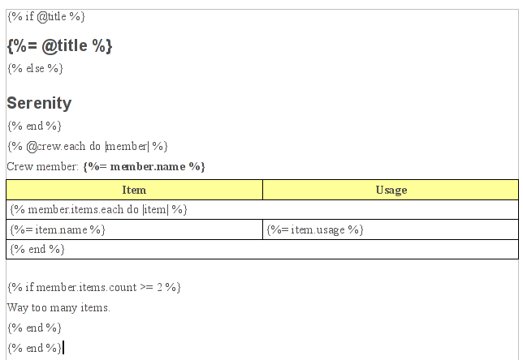
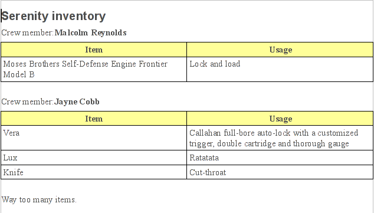

# Serenity Reports

Embedded Ruby for office documents. Provide an `.odt`, `.docx`, `.ods`, or `.xlsx` template with ERB-like markup and your data — Serenity Reports generates the document. Output to PDF is also supported.

## Installation

Add to your Gemfile:

```ruby
gem 'serenity_reports'
```

Or install directly:

```bash
gem install serenity_reports
```

### Dependencies

- **rubyzip** (>= 2.0)
- **nokogiri** (>= 1.10)

For PDF output, install one of:

```bash
# Lightweight (recommended) — handles ODT and DOCX
brew install pandoc typst

# Full-featured — handles all formats including ODS and XLSX
brew install --cask libreoffice
```

## Quick Start

```ruby
require 'serenity_report'

@name = 'Malcolm Reynolds'
@title = 'captain'

template = SerenityReport::Template.new('template.odt', 'output.odt')
template.process(binding)
```

## Template Syntax

Open your document in LibreOffice or Word and use these markers directly in the text:

| Syntax | Purpose | Example |
|---|---|---|
| `` | Output with XML escaping | `` |
| `` | Control flow | `` |
| `{%% expr %}` | Output without escaping | `{%% @raw %}` |

### Variables

```
Hello , you are the .
```

### Loops

```

  Name: 
  Role: 

```

Loops work inside tables too — Serenity Reports duplicates table rows automatically for each iteration.

### Conditionals

```

  Details: 

```

## Supported Formats

| Format | Template | Output | PDF Output |
|---|---|---|---|
| OpenDocument Text | `.odt` | `.odt` | via pandoc or LibreOffice |
| Microsoft Word | `.docx` | `.docx` | via pandoc or LibreOffice |
| OpenDocument Spreadsheet | `.ods` | `.ods` | via LibreOffice only |
| Microsoft Excel | `.xlsx` | `.xlsx` | via LibreOffice only |

## Usage

### Direct API

```ruby
require 'serenity_report'

# ODT
template = SerenityReport::Template.new('report.odt', 'output.odt')
template.process(binding)

# DOCX
template = SerenityReport::Template.new('report.docx', 'output.docx')
template.process(binding)

# PDF — just change the output extension
template = SerenityReport::Template.new('report.odt', 'output.pdf')
template.process(binding)
```

### Generator Mixin

Include `SerenityReport::Generator` in your class to use `render_odt` with automatic output naming:

```ruby
class Report
  include SerenityReport::Generator

  Person = Struct.new(:name, :items)
  Item = Struct.new(:name, :usage)

  def generate
    @title = 'Serenity inventory'

    mals_items = [Item.new('Pistol', 'Lock and load')]
    mal = Person.new('Malcolm Reynolds', mals_items)

    jaynes_items = [
      Item.new('Vera', 'Full-bore auto-lock'),
      Item.new('Lux', 'Ratatata')
    ]
    jayne = Person.new('Jayne Cobb', jaynes_items)

    @crew = [mal, jayne]

    render_odt 'template.odt'                     # auto-names output
    render_odt 'template.odt', 'custom_output.odt' # explicit output path
    render_odt 'template.odt', 'report.pdf'        # PDF output
  end
end

Report.new.generate
```

### Image Replacement

Replace named images in templates using the `@images` hash:

```ruby
@images = {
  'logo' => '/path/to/new_logo.png',
  'chart' => '/path/to/chart.png'
}

template = SerenityReport::Template.new('report.odt', 'output.odt')
template.process(binding)
```

### Embedded Charts (ODT)

ODT templates with embedded charts are supported. When charts appear inside loops, Serenity Reports automatically duplicates the embedded objects and updates internal references.

## Showcase

Template with placeholders:



Generated output:



## Architecture

```
Template → Processor → XmlReader → OdtEruby → Line classes → Output
```

- **Template** — Entry point. Detects format, opens the ZIP archive, delegates to the appropriate processor.
- **OdtProcessor** — Processes `content.xml`, `styles.xml`, and embedded objects.
- **DocxProcessor** — Processes `word/document.xml`, headers, and footers.
- **OdsProcessor** — Processes ODS spreadsheet content.
- **XlsxProcessor** — Processes XLSX with shared string handling.
- **OdtEruby** — Core template engine. Parses XML, converts markup to Ruby code.
- **XmlReader** — Streams XML and classifies nodes as TAG, CONTROL, or TEMPLATE.
- **ImagesProcessor** — Replaces images in templates.

## Development

```bash
# Run all tests
rake spec

# Run a single test file
rspec spec/template_spec.rb

# Build the gem
gem build serenity_reports.gemspec
```

## License

MIT

## Credits

Originally based on [serenity](https://github.com/kremso/serenity) by Tomas Kramar.
